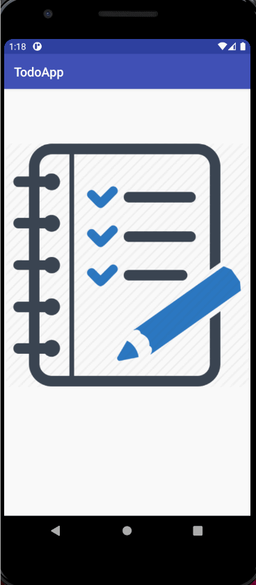
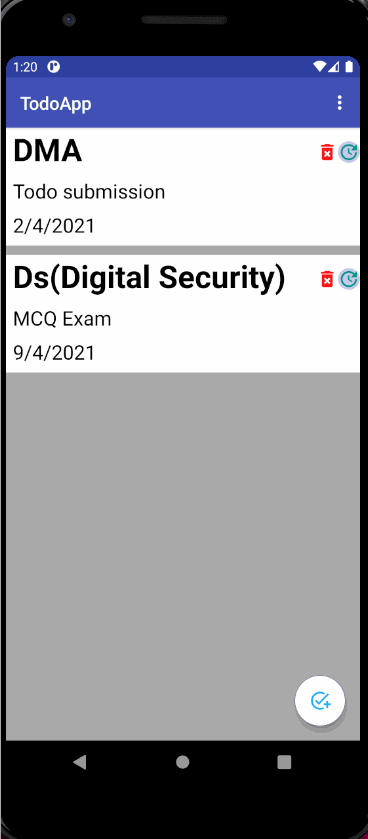
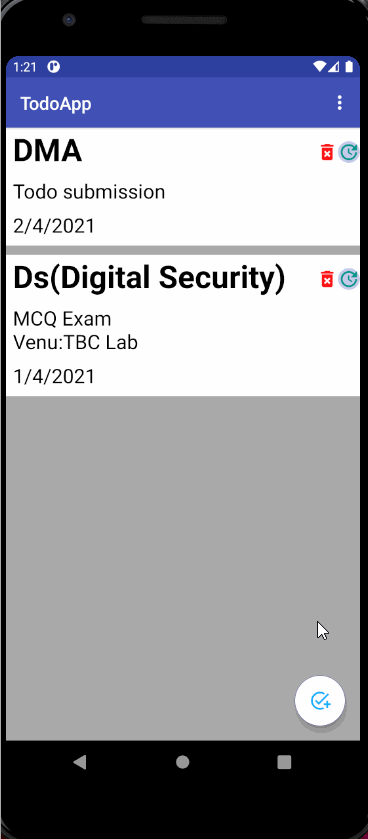
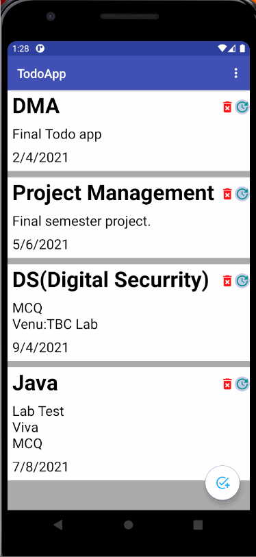
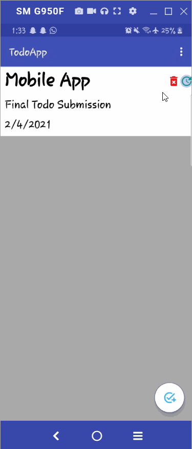
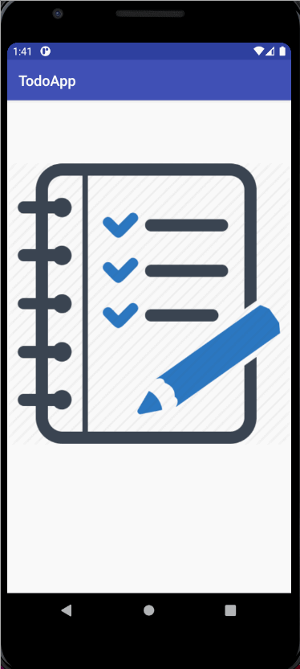
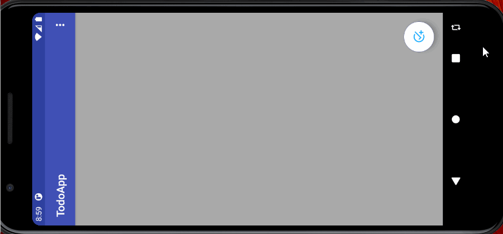

# TodoAppFinalAssignment

Reference : https://github.com/ebbi/TodoMVVM
          : https://github.com/binay-shah/android-todo
          : stackoverflow
          : Android Developers
          : Youtube
          
      successfully insert data
 
    
      successfully update data
 
   
     successfully delete one by one data
 

    successfully deletall the data from list
 

    successfully share data from mail
 
 
           todoapp
 
 
           Landscape
  

